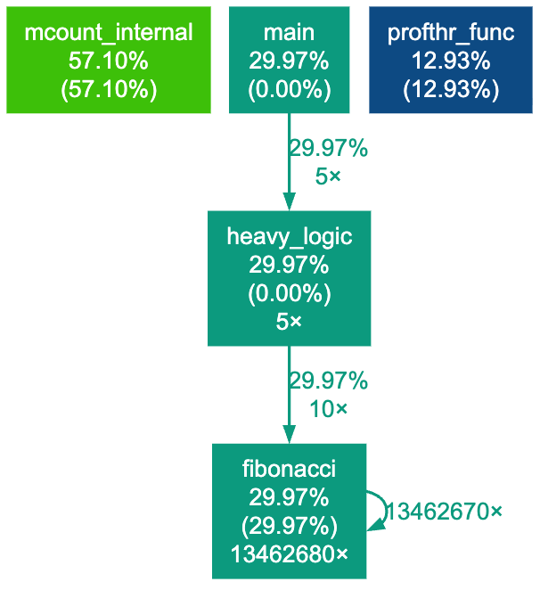
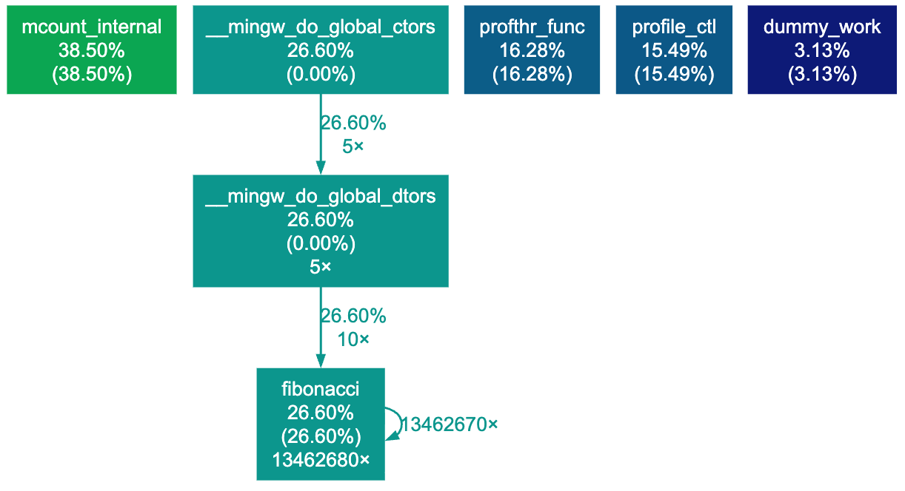

Gprof test program
------------------

 - Needs gprof-enabled CeGCC.
 - `make` to compile AppMain.exe.

## CFLAGS

By default, GCC emits code that is not comformant to [APCS](https://www.cl.cam.ac.uk/~fms27/teaching/2001-02/arm-project/02-sort/apcs.txt).
Gprof's `_mcount` assumes APCS-compliant and `fp` being present in the binary.

- `-mapcs-frame` is disabled by default for all optimization level
  - It leads to a crash without APCS. Must be enabled explicitly.
- `-fno-omit-frame-pointer` is enabled for all optimization level but `-O0`
  - It might have some effect on the compilation, but not sure
  - As I experiment unsetting (disabling) this flag, it doesn't crash even with `-O2`

## Experiment results: flags' effect

- `-fno-omit-frame-pointer` looks like it has nothing to do with calling convention because of `-mapcs-frame`
- Optimization other than `-O0` optimizes the func call (inlining etc) and the resulting graph becomes strange (lack of main() etc.)

|CFLAGS|Screenshot|
|:-----|:--------:|
|`-O0`||
|`-O2`||
